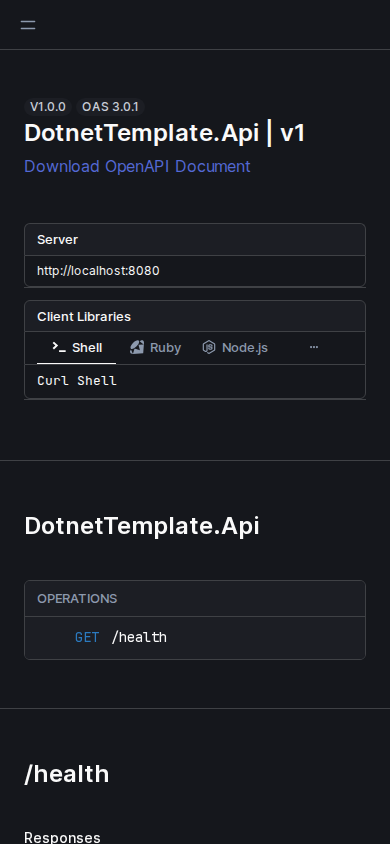
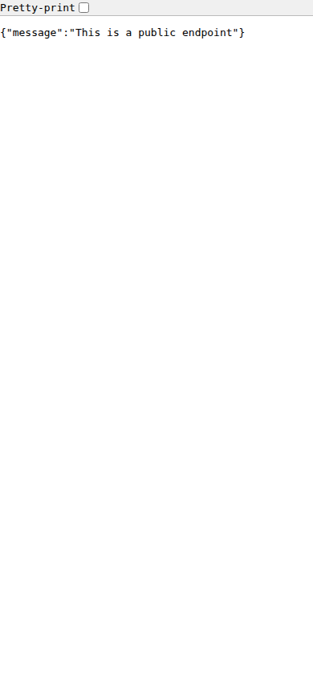

# dotnet-template — Quick Tutorial (10 minutes)

## Prerequisites

- .NET 9 SDK
- `make` (optional) and Docker (optional)
- Copy `.env.example` to `.env` and set `JWT_SECRET` (min 32 chars)

## What you'll build

Run the .NET Web API and capture mobile screenshots of the
interactive API docs and example routes.

## Steps

1. Restore + run

```bash
cd Templates/dotnet-template
make install
make run
# or: dotnet restore && dotnet run --project src/DotnetTemplate.Api
```

2. The app listens on `http://localhost:8080` by default

3. Capture mobile screenshots

```bash
bash Scripts/ubuntu/screenshots-generic.sh \
  --config Templates/dotnet-template/docs/screenshot-config.json
```

4. See mobile images in:

`Templates/dotnet-template/docs/screenshots/v1`

Preview placeholders:



